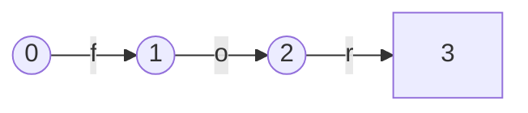
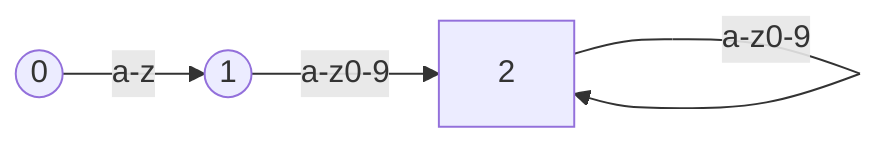
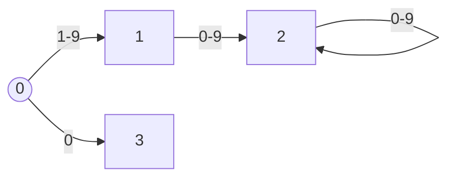
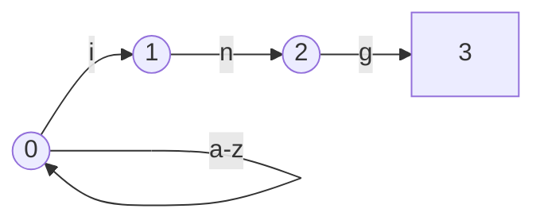
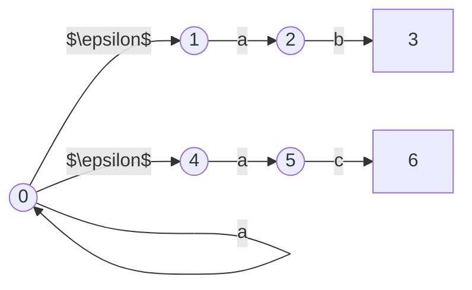

<head>
    <script src="https://cdn.mathjax.org/mathjax/latest/MathJax.js?config=TeX-AMS-MML_HTMLorMML" type="text/javascript"></script>
    <script type="text/x-mathjax-config">
        MathJax.Hub.Config({
            tex2jax: {
            skipTags: ['script', 'noscript', 'style', 'textarea', 'pre'],
            inlineMath: [['$','$']]
            }
        });
    </script>
</head>

<script type="module">
import mermaid from 'https://cdn.jsdelivr.net/npm/mermaid@10.0.2/+esm';
mermaid.initialize({ startOnLoad: false });
await mermaid.run({
  querySelector: '.language-mermaid',
});
</script>

## 词法单元的种类
扫描指的是从程序的原生文本源码中识别出词法单元的过程，需要编程语言设计者讲清楚精密的细节——哪些是允许的，哪些是不允许的。大多数语言的词法单元包含以下系列：
- 关键字
- 标识符
- 数字
- 字符串
- 注释和空格

设计新的编程语言语言或者为已有编程语言设计编译器的时候，首先要做的就是讲清楚每个类型的词法单元所允许的字符。下面是一种非正式的实现方式。

## 手制的扫描器
```
token_t scan_token( FILE *fp ) {
    int c = fgetc(fp);
    if(c == '*')
    {
        return TOKEN_MULTIPLY;
    }
    else if(c == '!')
    {
        char d = fgetc(fp);
        if(d == '=')
        {
            return TOKEN_NOT_EQUAL;
        }
        else
        {
            ungetc(d, fp);
            return TOKEN_NOT;
        }
    }
    else if(isalpha(c))
    {
        do
        {
            char d = fgetc(fp);
        }
        while(isalnum(d));
        ungetc(d, fp);
        return TOKEN_IDENTIFIER;
    }
    else if(...)
    {
        ...
    }
}
```

如上所示，手写的扫描器非常冗长。当加入更多类型的词法单元时，扫描器会显得错综复杂，尤其是一些包含相同序列的词法单元。开发者也很难将扫描器代码和每个词法单元的预期定义对应起来。在输入复杂的情况下，可能会导致难以预料的错误。也就是说，对于词法单元不多的小语言，手写的扫描器可以是合适的方案。

对于包含大规模词法单元的复杂语言，我们需要更加形式化的方法来定义和扫描词法单元。形式化方法可以让我们更有把握词法单元之间并不冲突和扫描器实现的正确性。此外，形式化方法也有助于我们得到紧凑的扫描器，提高扫描性能。

正则表达式和有限状态机允许我们准确地声明给定的词法单元。接着，自动化工具可以处理这些定义，寻找错误和模糊性，输出紧凑、高性能的代码。

## 正则表达式
正则表达式是表达模式的一种语言。我们可用正则表达式来作为一种紧凑和形式化的方法来识别出编译器扫描器接收的词法单元，并将这些表达式翻译成可以工作的代码。让我们准确地定义正则表达式。

正则表达式$s$是代表$L(s)$的字符串，而$L(s)$是一个字符串的集合，这个字符串可看作“$s$的语言”。首先，由如下的基础定义。
- 如果$a \in \Sigma$,那么$a$是正则表达式且L(a) = {a}。
- $\epsilon$是正则表达式，且$L(\epsilon)$只包含空字符串。

接着，对于任意的正则表达式$s$和$t$,有
- s\|t 是正则表达式，满足$ L(s \| t) = L(s) \cup L(t)$。
- st是正则表达式，满足L(st)包含了L(s)和L(t)组合起来的所有可能。
- s* 是正则表达式，满足L(s*)包含L(s)的0次或多次连接。

上面定义的语法可以用来表示任意的正则表达式。下面是建立在基础语法上的一些辅助语法。

|辅助语法|含义|
| --- | --- |
|s?|表示s是可选的，可以写成($s \| \epsilon$)|
|s+|表示s可以重复1到多次，可以写成$ss*$|
|[a-z]|表示范围内的任意字符，可以写成(a\|b\|c\|...\|z)|
|[^x]|表示除了x的任意字符，可以写成$\Sigma$ - x|

正则表达式也遵守一些代数性质，如可结合性、可交换性、可分配性和幂等性：

|性质|表示|
| --- | --- |
|可结合性|a \| (b \| c) = (a \| b) \| c|
|可交换性|a \| b = b \| a|
|可分配性|a(b \| c) = ab \| ac|
|幂等性|a** = a*|

## 有限自动机
有限自动机是可以用来表示特定计算形式的抽象机器。以图表形式，有限自动机由一系列状态和这些状态之间的一系列边构成。每条边都会从字母表$\Sigma$中抽出一到多个符号进行标记。

有限自动机起始于初始态$S_0$，根据输入符号进入下一个状态。有限自动机的一些状态称作接收态，用矩形表示。当输入完成时，有限自动机处于接收态，我们称有限自动机接收该输入；当输入完成时有限自动机不处于接收态，我们称有限自动机拒绝该输入。正则表达式和有限自动机一一对应。对于简单的正则表达式，我们可以自行构造有限自动机。如下是关键字for的自动状态机。


如下是[a-z][a-z0-9]+形式标识符的有限自动机。


如下是([1-9] [0-9]*) | 0形式数字的有限自动机。


### 确定的有限自动机

上面的3个例子均为确定的有限自动机（Deterministic Finite Automation， DFA）。DFA是有限自动机的一种特殊情况，其中对于每个给定的输入符号，每个状态最多只有一条输出边。这也意味着已知当前状态和输出符号时，将要做的选择是确定的，因此在软件或硬件中，都是容易实现的。

### 不确定的有限自动机

DFA的一个替代品是不确定的有限自动机（Nondeterministic Finite Automation， NFA）。考虑正则表达式[a-z]*ing，其表示所有后缀为ing的小写单词。它可以表示成如下的自动机。

对于单词sing， 初始状态为0。输入s时保留在初始状态0。继续输入s时，既可以保留在初始状态0，也可以进入初始状态1。若保留在初始状态0，最后处理完整个单词时出于初始状态0，为非接收态；若进入初始状态1，最后进入状态3，为接收态。两种选择都遵守传输规则，但得到的结果并不一样。

NFA也可以接收空字符，记作$\epsilon$，也就以为不需要接收字符就可以完成状态切换。下面用NFA来表示a*(ab|ac)。




